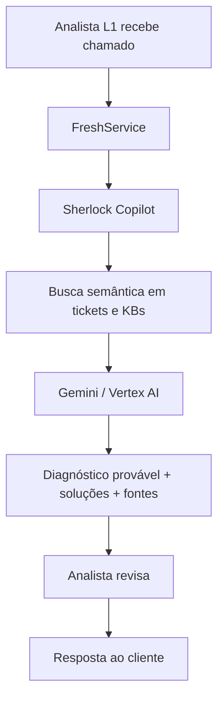

# Sherlock — Copiloto de Suporte para ClearIT

Agente de IA que auxilia analistas de suporte L1 a diagnosticar e resolver incidentes com mais agilidade, buscando automaticamente em bases de conhecimento, histórico de chamados e documentação técnica.

## O Problema

Os analistas de suporte da ClearIT gastam a maior parte do tempo **buscando informação** — não resolvendo o problema. O conhecimento está disperso entre tickets antigos, KBs internos e documentação de fabricantes. A busca da plataforma atual (FreshService) exige termos exatos, e o mesmo problema aparece com títulos diferentes em tickets distintos.

Resultado: tempo de resolução elevado, escalonamentos desnecessários e retrabalho.

## A Solução

Um copiloto que:
- Recebe a descrição do problema do analista
- Busca semanticamente em chamados encerrados e KBs (mesmo com títulos diferentes)
- Sugere diagnóstico, soluções possíveis e fontes de referência
- Quando a descrição é vaga, sugere passos de troubleshooting

O analista **sempre** valida antes de aplicar qualquer sugestão.

## Fluxo do Sherlock



1. O analista recebe ou consulta um chamado no FreshService.
2. O Sherlock recebe a descrição, logs ou sintomas informados no ticket.
3. O texto é convertido em embedding para permitir busca por significado.
4. A busca semântica recupera tickets antigos, KBs e documentos técnicos semelhantes.
5. O Gemini recebe o contexto encontrado e gera diagnóstico, possíveis soluções e fontes.
6. O analista valida, edita ou rejeita a sugestão antes de responder ao cliente.

## Estrutura do Repositório

```
./
├── README.md                         # Visão geral do projeto
├── business-context-lite.md          # Especificação de produto e Sprint 1
└── knowledge-base/
    ├── freshservice-api.md           # Pesquisa: API do FreshService
    ├── semantic-search-rag.md        # Pesquisa: Arquitetura RAG + Vertex AI
    └── fake-data.md                  # Pesquisa: Geração de dados de teste
```

## Stack Planejada

- **Google Cloud** (Vertex AI)
- **Gemini Pro** — geração de respostas
- **Text-embedding-004** — embeddings para busca semântica
- **LangChain** — orquestração RAG
- **ChromaDB** — vector store para protótipo

## Squad Sherlock (B5)

| Membro | Frente |
|--------|--------|
| Beatriz Andrade Lourenço | Negócios e Estratégia |
| Davi da Paz Mota | Tecnologia e Produto |
| Maria Eduarda Ferreira Santos | Tecnologia e Produto |
| Maria Eloisa Gomes da Conceição | Negócios e Estratégia |
| Phelipe Alexandre de Almeida | Tecnologia e Produto |

## Status

**Sprint 1 (Descoberta):** ✅ Concluído — Feature "Pronto para Dev"

## Validação do Escopo

**Status:** Aprovado para desenvolvimento da PoC/MVP

**Sprint:** 1 — Descoberta e documentação

**Data da validação:** 25/06/2026 (Sprint de Validação com ClearIT)

**Aprovado por:** Alexandre (Gestor de Operações, ClearIT) e Beatriz (Analista de Suporte, ClearIT)

**Escopo do MVP**
- Busca semântica em chamados encerrados.
- Consulta em bases de conhecimento internas.
- Busca em documentação técnica de fabricantes.
- Geração de diagnóstico provável com indicação das fontes utilizadas.
- Sugestão de troubleshooting quando a descrição do chamado for vaga ou insuficiente.

**Fora do escopo**
- Integração direta com ambiente produtivo da ClearIT durante o desenvolvimento.
- Execução automática de ações sem aprovação humana.
- Uso de dados reais de clientes sem anonimização.
- Substituição do analista humano na tomada de decisão.

**Restrições principais**
- Conformidade com LGPD.
- Uso de dados fictícios ou anonimizados no desenvolvimento.
- Atuação consultiva do copiloto, sempre com validação humana.

**Próxima revisão:** Sprint 2, antes da implementação da PoC.


---

*Desafio B — Serviços | Pulse Mais 2026*
